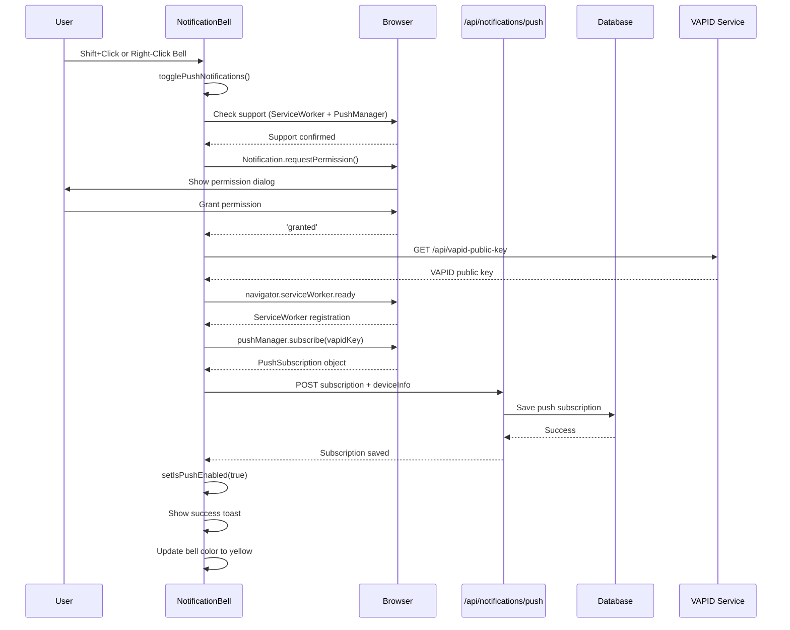
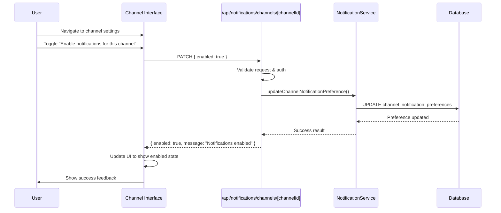
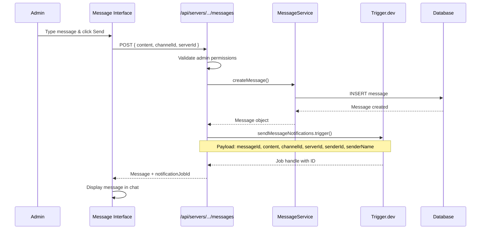
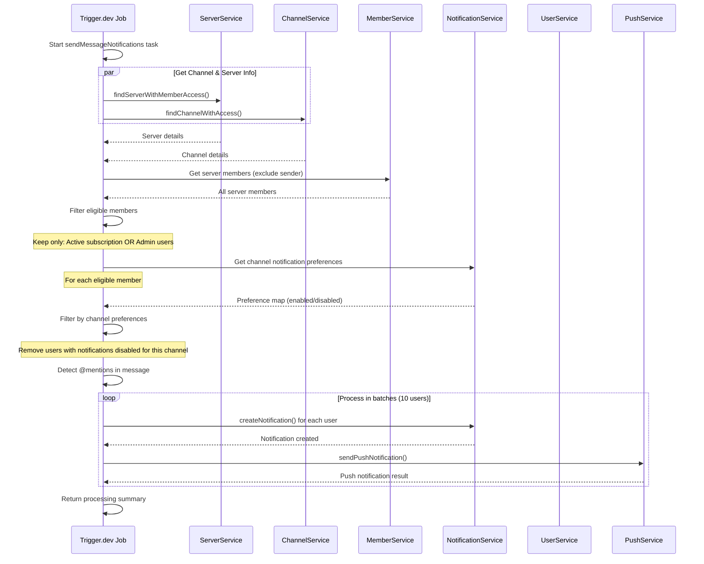
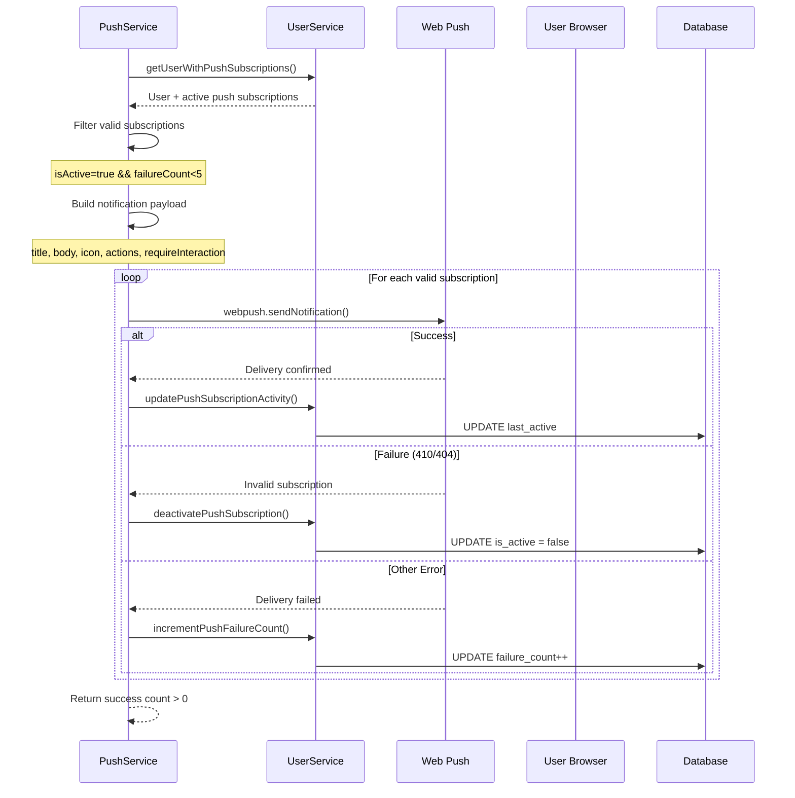
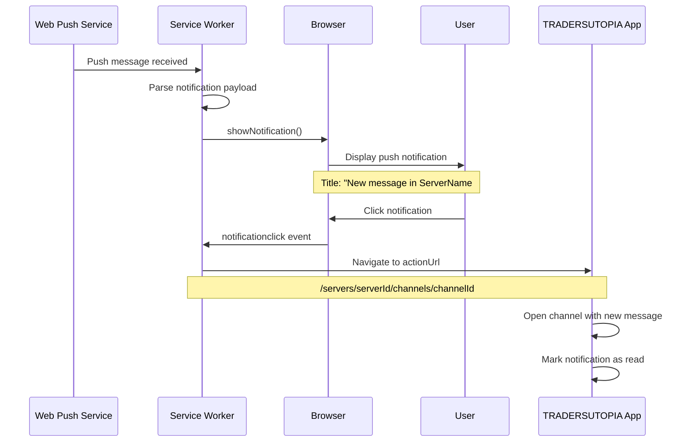
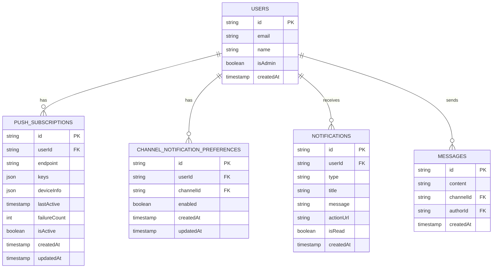

# TRADERSUTOPIA Notification System Flow
## Complete End-to-End Documentation

### 📋 Overview
This document details the complete notification flow in TRADERSUTOPIA, from user setup to message delivery. The system uses **Trigger.dev** for reliable background processing and supports both database notifications and push notifications.

### 🏗️ System Architecture

```mermaid
graph TB
    subgraph "Frontend Components"
        A[NotificationBell Component]
        B[Channel Settings]
        C[Browser Push API]
    end
    
    subgraph "API Layer"
        D[/api/notifications/push]
        E[/api/notifications/channels/[channelId]]
        F[/api/servers/[serverId]/channels/[channelId]/messages]
    end
    
    subgraph "Background Processing"
        G[Trigger.dev Jobs]
        H[sendMessageNotifications Task]
    end
    
    subgraph "Database Services"
        I[UserService]
        J[NotificationService]
        K[MessageService]
        L[MemberService]
    end
    
    subgraph "External Services"
        M[Web Push Service]
        N[VAPID Server]
    end
    
    A --> D
    B --> E
    F --> G
    G --> H
    H --> I
    H --> J
    H --> K
    H --> L
    H --> M
    C --> N
```

---

## 🔄 Complete User Journey Flow

### Phase 1: User Setup & Configuration

#### 1.1 Enable Push Notifications



**Visual State Changes:**
- **Before**: 🔔 Hollow bell (push notifications OFF)
- **After**: 🔔 Yellow filled bell (push notifications ON)

#### 1.2 Configure Channel Notifications



---

### Phase 2: Message Creation & Notification Processing

#### 2.1 Admin Sends Message



#### 2.2 Trigger.dev Background Processing



#### 2.3 Push Notification Delivery



---

### Phase 3: User Receives Notification

#### 3.1 Browser Notification Display



---

## 📊 Database Schema & Relationships

### Core Tables



---

## 🔧 Key Components & APIs

### Frontend Components

#### NotificationBell Component
- **Location**: `src/components/notifications/notification-bell.tsx`
- **Key Functions**:
  - `togglePushNotifications()` - Enable/disable push notifications
  - `checkPushStatus()` - Check current subscription status
  - Bell color indicates push notification state:
    - 🔔 Hollow = Push OFF
    - 🔔 Yellow = Push ON
    - 🔔 Red badge = Unread notifications

### API Endpoints

#### Push Notification Management
- **Endpoint**: `/api/notifications/push`
- **Methods**: 
  - `POST` - Subscribe to push notifications
  - `GET` - Check push notification status
  - `DELETE` - Unsubscribe from push notifications

#### Channel Notification Preferences
- **Endpoint**: `/api/notifications/channels/[channelId]`
- **Methods**:
  - `GET` - Get notification preference for channel
  - `PATCH` - Update notification preference

#### Message Creation
- **Endpoint**: `/api/servers/[serverId]/channels/[channelId]/messages`
- **Method**: `POST` - Create message and trigger notifications

### Background Jobs

#### Trigger.dev Task
- **Location**: `src/trigger/send-message-notifications.ts`
- **Function**: `sendMessageNotifications`
- **Features**:
  - Batch processing (10 users per batch)
  - Retry logic with exponential backoff
  - Comprehensive logging and monitoring
  - Mention detection
  - Channel preference filtering

---

## 🚀 Performance Optimizations

### 1. Batch Processing
- Process notifications in batches of 10 users
- Prevents overwhelming the system
- Optimized for AWS Amplify serverless functions

### 2. Subscription Management
- Automatic cleanup of invalid subscriptions
- Failure count tracking
- Activity-based subscription management

### 3. Channel Filtering
- Early filtering by channel notification preferences
- Reduces unnecessary processing
- User-controlled notification granularity

### 4. Database Optimization
- Indexed queries for performance
- Service layer for consistent data access
- Connection pooling for database efficiency

---

## 🔍 Monitoring & Observability

### Trigger.dev Dashboard
- Real-time job monitoring
- Success/failure rates
- Performance metrics
- Retry attempts and outcomes

### API Logging
- Structured logging with `apiLogger`
- Operation tracking and timing
- Error categorization and handling
- User action audit trail

### Error Handling
- Graceful degradation (DB notifications without push)
- Automatic retry mechanisms
- Invalid subscription cleanup
- Comprehensive error reporting

---

## 🛡️ Security & Permissions

### Authentication
- All endpoints require user authentication
- Admin-only message creation
- User-specific notification access

### CSRF Protection
- CSRF tokens for state-changing operations
- Rate limiting on all endpoints
- Input validation with Zod schemas

### Push Security
- VAPID authentication for push notifications
- Secure subscription key handling
- Device fingerprinting for subscription management

---

## 🔄 Complete Flow Summary

1. **Setup Phase**:
   - User enables push notifications (bell turns yellow)
   - User configures channel notification preferences

2. **Message Phase**:
   - Admin sends message
   - API creates message and triggers background job
   - Trigger.dev processes eligible recipients

3. **Processing Phase**:
   - Filter by subscription status (active/admin)
   - Check channel notification preferences
   - Create database notifications
   - Send push notifications with error handling

4. **Delivery Phase**:
   - Push notifications appear in browser
   - User clicks to navigate to channel
   - Notifications marked as read

This architecture ensures **reliable**, **scalable**, and **user-controlled** notification delivery with comprehensive monitoring and error handling.