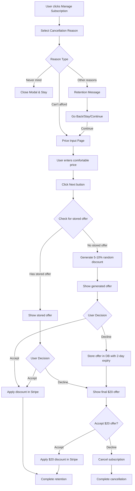

# Cancellation Flow Improvement - Implementation Plan

## Executive Summary

This document outlines the implementation plan for improving the subscription cancellation flow. The key enhancement is a personalized discount system that generates random 5-10% discounts based on user input, with smart persistence to prevent discount shopping.

## Key Business Rule

**Important**: Custom discount offers are **only stored in the database when rejected**. This prevents users from repeatedly generating new discounts by reopening the modal.

## Flow Diagram



## 1. Database Schema Changes

### New Table: `custom_discount_offers`

```prisma
model CustomDiscountOffer {
  id                  String    @id @default(cuid())
  userId              String
  subscriptionId      String
  originalPriceCents  Int       // Original subscription price in cents
  userInputCents      Int       // User's comfortable price in cents
  offerPriceCents     Int       // Generated offer price in cents
  discountPercent     Float     // Percentage discount (5-10%)
  savingsCents        Int       // Amount saved in cents
  expiresAt           DateTime  // 2 days from creation
  isExpired           Boolean   @default(false)
  acceptedAt          DateTime?
  createdAt           DateTime  @default(now())
  updatedAt           DateTime  @updatedAt
  
  user                User      @relation(fields: [userId], references: [id], onDelete: Cascade)
  
  @@unique([userId, subscriptionId]) // Only one active offer per user/subscription
  @@index([userId])
  @@index([expiresAt])
  @@index([isExpired])
  @@map("custom_discount_offers")
}
```

### Update User Model

```prisma
model User {
  // ... existing fields ...
  customDiscountOffers CustomDiscountOffer[]
}
```

## 2. UI/UX Changes

### Current Flow vs New Flow

| Step | Current Flow | New Flow |
|------|-------------|----------|
| Price Input Buttons | "Skip to cancel →" and "Get My Custom Offer!" | "Cancel" (closes modal) and "Next" |
| After Price Input | Immediately shows offer | Check for stored offer first, then generate if none exists |
| Offer Storage | Never stored | Stored only when rejected |
| Final Offer | None | Hard-coded $20 offer after custom offer rejection |

### Modal State Changes

```typescript
// Additional state needed
const [hasStoredOffer, setHasStoredOffer] = useState(false);
const [storedOfferDetails, setStoredOfferDetails] = useState<StoredOffer | null>(null);
const [showFinalOffer, setShowFinalOffer] = useState(false);
```

## 3. API Endpoints

### 3.1 Check for Existing Offer
**GET** `/api/subscription/custom-offer`

```typescript
// Response
{
  success: boolean;
  offer?: {
    id: string;
    originalPriceCents: number;
    userInputCents: number;
    offerPriceCents: number;
    discountPercent: number;
    savingsCents: number;
    expiresAt: string;
  }
}
```

### 3.2 Store Rejected Offer
**POST** `/api/subscription/custom-offer/reject`

```typescript
// Request
{
  originalPriceCents: number;
  userInputCents: number;
  offerPriceCents: number;
  discountPercent: number;
}

// Response
{
  success: boolean;
  offerId: string;
  expiresAt: string;
}
```

### 3.3 Accept Stored Offer
**POST** `/api/subscription/custom-offer/accept`

```typescript
// Request
{
  offerId: string;
}

// Response
{
  success: boolean;
  message: string;
  offer: {
    id: string;
    subscriptionId: string;
    originalPriceCents: number;
    offerPriceCents: number;
    discountPercent: number;
    percentOff: number;
    acceptedAt: string;
  };
  applyCouponData: {
    percentOff: number;
    newMonthlyPrice: number;
    currentPrice: number;
    originalPrice: number;
    subscriptionId: string;
  };
}
```

## 4. Service Layer

### DiscountOfferService

```typescript
// src/services/database/discount-offer-service.ts
export class DiscountOfferService extends BaseService {
  /**
   * Get active (non-expired) offer for user
   */
  async getActiveOffer(userId: string, subscriptionId: string): Promise<CustomDiscountOffer | null> {
    const offer = await this.db.customDiscountOffer.findUnique({
      where: {
        userId_subscriptionId: { userId, subscriptionId }
      }
    });

    if (!offer) return null;

    // Check expiration
    if (new Date() > offer.expiresAt || offer.isExpired) {
      await this.markAsExpired(offer.id);
      return null;
    }

    return offer;
  }

  /**
   * Store rejected offer (called only when user declines)
   */
  async storeRejectedOffer(params: {
    userId: string;
    subscriptionId: string;
    originalPriceCents: number;
    userInputCents: number;
    offerPriceCents: number;
    discountPercent: number;
  }): Promise<CustomDiscountOffer> {
    const expiresAt = new Date();
    expiresAt.setDate(expiresAt.getDate() + 2); // 2 days

    return await this.db.customDiscountOffer.upsert({
      where: {
        userId_subscriptionId: {
          userId: params.userId,
          subscriptionId: params.subscriptionId
        }
      },
      update: {
        ...params,
        savingsCents: params.userInputCents - params.offerPriceCents,
        expiresAt,
        isExpired: false
      },
      create: {
        ...params,
        savingsCents: params.userInputCents - params.offerPriceCents,
        expiresAt
      }
    });
  }

  /**
   * Mark offer as accepted and apply to Stripe
   */
  async acceptOffer(offerId: string): Promise<{ success: boolean }> {
    const offer = await this.db.customDiscountOffer.update({
      where: { id: offerId },
      data: { acceptedAt: new Date() }
    });

    // Apply discount to Stripe subscription
    // ... Stripe integration logic ...

    return { success: true };
  }
}
```

## 5. Business Logic

### Discount Generation Algorithm

```typescript
/**
 * Generate a random discount between 5-10% off the user's input price
 */
function generateCustomDiscount(userInputCents: number): {
  discountPercent: number;
  offerPriceCents: number;
  savingsCents: number;
} {
  // Generate random percentage between 5 and 10
  const minDiscount = 5;
  const maxDiscount = 10;
  const discountPercent = Math.random() * (maxDiscount - minDiscount) + minDiscount;
  
  // Calculate offer price
  const discountAmount = Math.round(userInputCents * (discountPercent / 100));
  const offerPriceCents = userInputCents - discountAmount;
  
  return {
    discountPercent: Math.round(discountPercent * 100) / 100, // Round to 2 decimals
    offerPriceCents,
    savingsCents: discountAmount
  };
}
```

### Final Offer (Hard-coded)

```typescript
const FINAL_OFFER = {
  amountCents: 2000, // $20
  description: "Last chance: Try us for just $20",
  isHardcoded: true
};
```

## 6. Frontend Implementation

### Key Component Updates

```typescript
// CancellationFlowModal.tsx changes

const handlePriceSubmit = async () => {
  // 1. Check for existing stored offer
  const existingOffer = await checkForStoredOffer();
  
  if (existingOffer) {
    setStoredOfferDetails(existingOffer);
    setHasStoredOffer(true);
    // Show stored offer
  } else {
    // 2. Generate new discount
    const discount = generateCustomDiscount(dollarsToCents(priceInput));
    setOfferDetails(discount);
    // Show generated offer (not stored yet)
  }
};

const handleOfferDecline = async () => {
  if (!hasStoredOffer) {
    // 3. Store the offer only when rejected
    await storeRejectedOffer(offerDetails);
  }
  
  // 4. Show final $20 offer
  setShowFinalOffer(true);
};

const handleOfferAccept = async () => {
  try {
    // 1. Accept the offer in database
    const acceptResponse = await fetch('/api/subscription/custom-offer/accept', {
      method: 'POST',
      headers: { 'Content-Type': 'application/json' },
      body: JSON.stringify({ offerId: offer.id })
    });
    
    const acceptData = await acceptResponse.json();
    
    if (!acceptResponse.ok) {
      throw new Error(acceptData.error);
    }
    
    // 2. Apply the discount via Stripe
    const couponResponse = await fetch('/api/subscription/apply-coupon', {
      method: 'POST',
      headers: { 'Content-Type': 'application/json' },
      body: JSON.stringify(acceptData.applyCouponData)
    });
    
    const couponData = await couponResponse.json();
    
    if (!couponResponse.ok) {
      throw new Error(couponData.error);
    }
    
    // Success: discount applied
    showToast.success('Discount Applied!', 'Your custom offer has been applied to your subscription');
    onComplete('discounted');
    handleClose();
    
  } catch (error) {
    showToast.error('Error', 'Failed to apply discount. Please try again.');
  }
};
```

## 7. Implementation Timeline

### Phase 1: Backend Foundation (2 days)
- [ ] Create database migration
- [ ] Implement DiscountOfferService
- [ ] Create API endpoints
- [ ] Add validation and security checks

### Phase 2: Frontend Updates (2 days)
- [ ] Update CancellationFlowModal component
- [ ] Implement offer checking logic
- [ ] Add new UI states and transitions
- [ ] Update button text and behavior

### Phase 3: Integration & Testing (1 day)
- [ ] Connect frontend to backend
- [ ] Test all flow paths
- [ ] Verify Stripe integration
- [ ] Handle edge cases

### Phase 4: Deployment (1 day)
- [ ] Deploy database changes
- [ ] Deploy backend services
- [ ] Deploy frontend with feature flag
- [ ] Monitor and verify

## 8. Success Metrics

- **Retention Rate**: % of users who accept custom offers
- **Discount Effectiveness**: Average discount % that converts
- **Return Rate**: % of users who return to see stored offers
- **Final Offer Conversion**: % who accept the $20 offer

## 9. Security Considerations

1. **Rate Limiting**: Prevent rapid offer generation attempts
2. **Validation**: Ensure user owns the subscription
3. **Expiration**: Automatic cleanup of expired offers
4. **Audit Trail**: Log all offer interactions

## 10. Edge Cases & Handling

| Edge Case | Handling |
|-----------|----------|
| User clears browser data | Offer persists server-side |
| Subscription ends before offer accepted | Invalidate offer |
| Multiple browser sessions | Show same stored offer |
| Price input validation | Min $1, Max current price |

## 11. Future Enhancements

1. **A/B Testing**: Test different discount ranges
2. **ML Optimization**: Personalize discount % based on user behavior
3. **Seasonal Offers**: Special retention offers during key periods
4. **Win-back Campaigns**: Re-engage users with expired offers

## Approval Checklist

- [ ] Database schema approved
- [ ] API design approved
- [ ] UI/UX flow approved
- [ ] Security measures adequate
- [ ] Timeline acceptable
- [ ] Success metrics defined

---

**Next Steps**: Upon approval, we'll begin with Phase 1 (Backend Foundation) starting with the database migration.