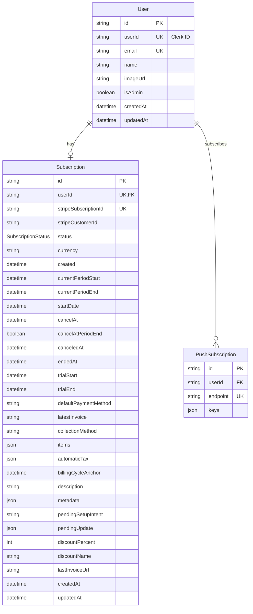
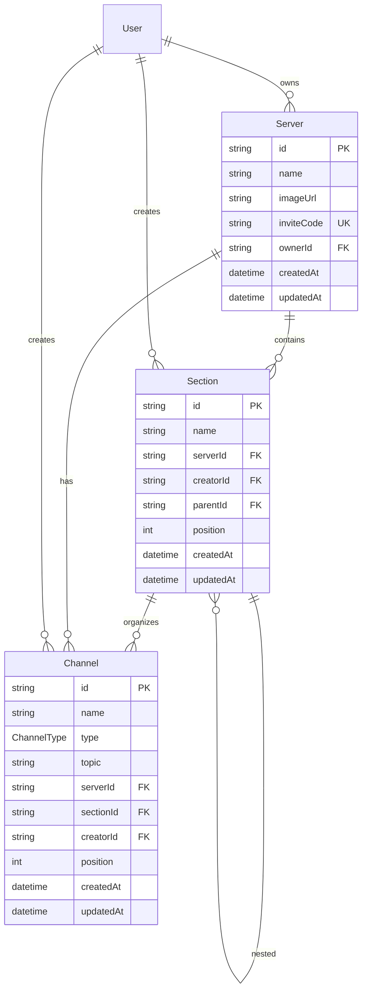
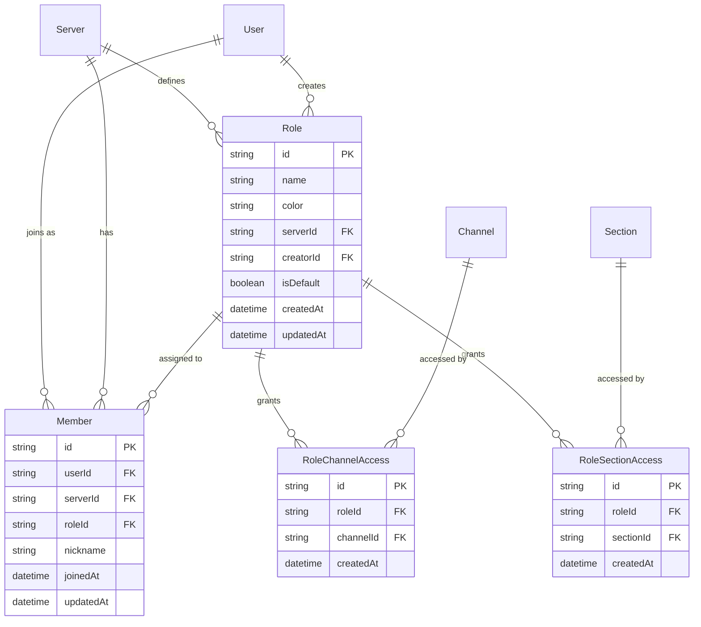
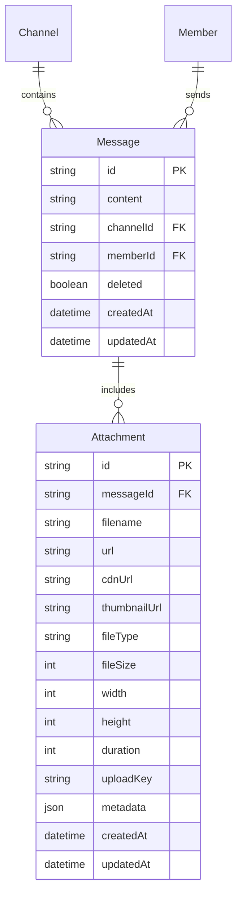
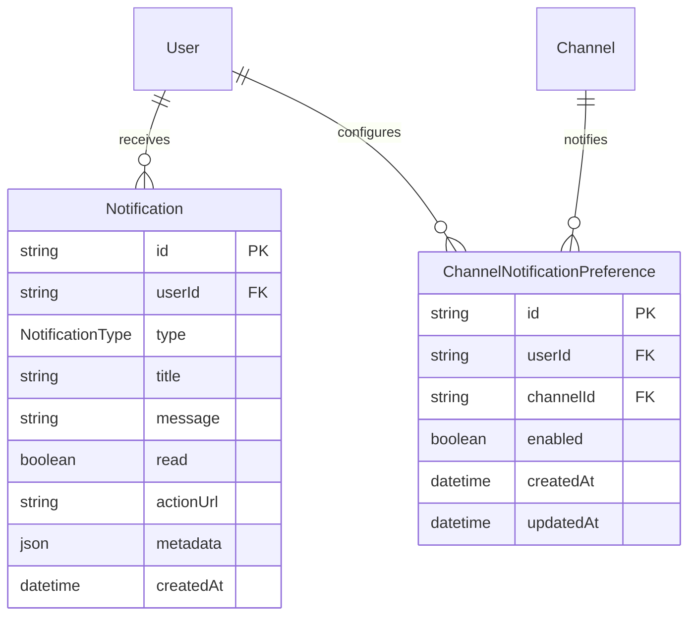

# Database Schema Design - TRADERSUTOPIA

## Overview

The TRADERSUTOPIA database schema is designed for a subscription-based chat platform with Discord-like features, built on PostgreSQL with Prisma ORM. The schema emphasizes performance, security, and scalability while supporting role-based access control and subscription management.

## Design Principles

### 1. **Clean Separation of Concerns**
- **User Management**: Core user data separate from subscription details
- **Access Control**: Role-based permissions with granular channel/section access
- **Subscription Management**: Single source of truth for Stripe integration
- **Messaging**: Optimized for admin-only messaging with multiple attachments

### 2. **Performance Optimization**
- Strategic indexing on frequently queried fields
- Efficient relationship modeling to minimize JOIN operations
- Direct Clerk user ID integration (no intermediate Profile model)
- Optimized cascade deletion and relationship management

### 3. **Security & Access Control**
- Role-based access control at server, section, and channel levels
- Admin-only message sending capability
- Secure subscription status tracking
- Comprehensive notification preferences

## Entity Relationship Diagrams

### Core User & Subscription Management



### Server Organization & Structure



### Access Control & Membership



### Messaging & Attachments



### Notification System



## Key Design Decisions

### 1. **Direct Clerk Integration**
**Decision**: Use `User.userId` as direct Clerk ID instead of intermediate Profile model.
**Rationale**: 
- Eliminates unnecessary joins and complexity
- Improves query performance
- Simplifies authentication flow
- Reduces data redundancy

### 2. **Comprehensive Subscription Model**
**Decision**: Single `Subscription` model with all Stripe fields.
**Rationale**:
- Single source of truth for subscription data
- Supports complex billing scenarios (trials, discounts, cancellations)
- Maintains full Stripe metadata for audit trails
- Enables advanced subscription management features

### 3. **Role-Based Access Control**
**Decision**: Granular permissions with `RoleChannelAccess` and `RoleSectionAccess`.
**Rationale**:
- Supports flexible premium/free tier access
- Scales to future role complexity
- Enables fine-grained content access control
- Maintains performance with proper indexing

### 4. **Admin-Only Messaging**
**Decision**: Only admin users can send messages.
**Rationale**:
- Aligns with business model (content creators → subscribers)
- Simplifies moderation and content control
- Reduces spam and noise
- Focuses on high-quality content delivery

### 5. **Multiple Attachments Architecture**
**Decision**: Separate `Attachment` model with rich metadata.
**Rationale**:
- Supports multiple files per message
- Enables CDN optimization and transformations
- Provides detailed file metadata for UI/UX
- Scales to future media processing needs

### 6. **Hierarchical Sections**
**Decision**: Self-referencing `Section` model with `parentId`.
**Rationale**:
- Supports nested category organization
- Flexible content hierarchy
- Mimics familiar Discord-like UX
- Maintains referential integrity

## Indexing Strategy

### Primary Indexes
- All primary keys (automatic)
- All foreign keys for relationship performance
- Unique constraints on critical business fields

### Performance Indexes
```sql
-- User lookups
CREATE INDEX idx_users_clerk_id ON users(userId);
CREATE INDEX idx_users_email ON users(email);

-- Server relationships
CREATE INDEX idx_servers_owner ON servers(ownerId);
CREATE INDEX idx_members_user_server ON members(userId, serverId);
CREATE INDEX idx_members_server ON members(serverId);
CREATE INDEX idx_members_role ON members(roleId);

-- Channel organization
CREATE INDEX idx_channels_server ON channels(serverId);
CREATE INDEX idx_channels_section ON channels(sectionId);
CREATE INDEX idx_channels_position ON channels(position);

-- Message performance
CREATE INDEX idx_messages_channel_created ON messages(channelId, createdAt);
CREATE INDEX idx_messages_member ON messages(memberId);

-- Notification queries
CREATE INDEX idx_notifications_user_read ON notifications(userId, read);
CREATE INDEX idx_notifications_type ON notifications(type);
CREATE INDEX idx_notifications_created ON notifications(createdAt);

-- Subscription lookups
CREATE INDEX idx_subscriptions_stripe_id ON subscriptions(stripeSubscriptionId);
CREATE INDEX idx_subscriptions_customer ON subscriptions(stripeCustomerId);
CREATE INDEX idx_subscriptions_status ON subscriptions(status);
```

## Data Types & Constraints

### Enums

#### ChannelType
- `TEXT`: Standard text channels
- `ANNOUNCEMENT`: Admin announcement channels

#### SubscriptionStatus
- `FREE`: No Stripe subscription
- `INCOMPLETE`: Payment method not yet added
- `INCOMPLETE_EXPIRED`: Expired before payment
- `TRIALING`: Active trial period
- `ACTIVE`: Paid and active
- `PAST_DUE`: Payment failed but not canceled
- `CANCELED`: Canceled subscription
- `UNPAID`: Multiple payment failures
- `PAUSED`: Temporarily paused

#### NotificationType
- `NEW_MESSAGE`: Channel message notifications
- `ADMIN_ANNOUNCEMENT`: Important announcements
- `SUBSCRIPTION_*`: Billing and subscription events
- `DISCOUNT_APPLIED`: Promotional notifications
- `PAYMENT_FAILED`: Payment issue alerts
- `TRIAL_ENDING`: Trial expiration warnings
- `SYSTEM`: General system notifications

### Key Constraints

#### Business Logic Constraints
- Server owners must be admin users
- Message senders must be admin members
- Role assignments must match server membership
- Channel/Section access must be within server boundaries

#### Data Integrity
- Cascade deletions for parent-child relationships
- Unique constraints on critical business identifiers
- Foreign key constraints with appropriate cascade rules

## Security Considerations

### Access Control
- Role-based permissions prevent unauthorized access
- Server-scoped role assignments
- Admin-only content creation capabilities

### Data Protection
- Sensitive Stripe data properly encrypted
- User data isolation by server membership
- Audit trails through timestamp tracking

### Performance Security
- Indexed queries prevent table scans
- Optimized joins reduce query complexity
- Proper relationship modeling prevents N+1 queries

## Migration Strategy

### Fresh Start Approach
- Clean schema implementation from scratch
- No legacy migration complexity
- Optimal relationship design
- Modern Prisma best practices

### Seed Data Requirements
See `docs/database/seed-data.md` for detailed seeding strategy and sample data.

## Future Extensibility

### Planned Enhancements
- Additional role types (VIP, Premium+, etc.)
- Message reactions and threading
- Voice channel support
- Advanced notification targeting
- Subscription plan variations

### Schema Flexibility
- JSON fields for extensible metadata
- Enum expansion capabilities
- Hierarchical section nesting
- Modular attachment system

## Performance Characteristics

### Query Optimization
- Primary key lookups: O(1)
- Server membership checks: O(log n)
- Channel message queries: O(log n) with date indexing
- Role permission checks: O(1) with proper caching

### Scalability Targets
- 10,000+ concurrent users
- 100+ servers per user
- 1M+ messages per server
- Sub-100ms query response times

---

*This schema design supports TRADERSUTOPIA's vision of a premium content delivery platform with Discord-like organization and robust subscription management.* 