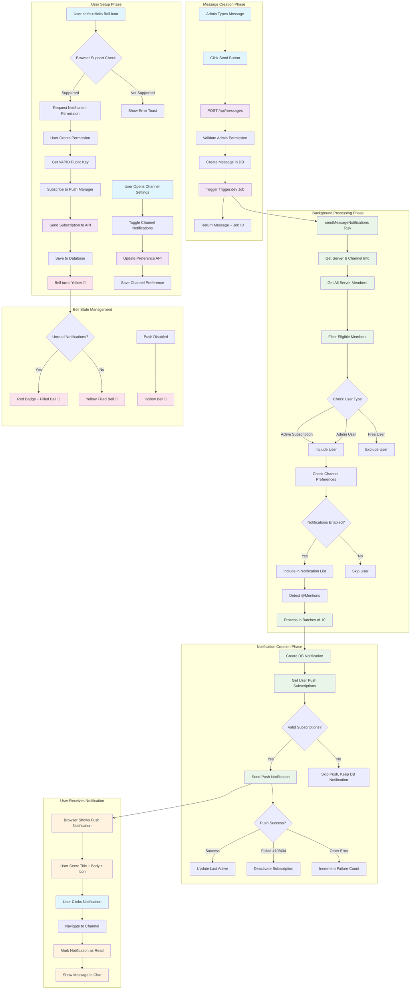

# TRADERSUTOPIA Notification System - Complete Flow Diagram

## 📋 Overview
This diagram shows the complete end-to-end flow of the TRADERSUTOPIA notification system, from user setup through message delivery.

## 🎨 Interactive Flow Diagram



## 🔍 Diagram Legend

### Color Coding
- **Light Blue** 🟦 User Actions (clicks, interactions)
- **Light Purple** 🟪 API Calls (HTTP requests)
- **Light Green** 🟩 Background Processing (Trigger.dev jobs)
- **Light Orange** 🟧 Notification Delivery (browser notifications)
- **Light Pink** 🟣 State Management (bell icon states)

### Key Decision Points
- **Browser Support Check**: Validates ServiceWorker + PushManager availability
- **User Type Check**: Filters for active subscribers or admin users
- **Channel Preferences**: Respects per-channel notification settings
- **Push Success**: Handles different failure scenarios with appropriate actions

### Bell Icon States
| State | Icon | Description |
|-------|------|-------------|
| Disabled | 🔔 Hollow | Push notifications OFF |
| Enabled | 🔔 Yellow | Push notifications ON, no unread |
| Unread | 🔔 Red Badge | Push notifications ON, has unread notifications |

## 🚀 Flow Summary

1. **Setup Phase**: User enables push notifications and configures channel preferences
2. **Message Phase**: Admin creates message, triggering background processing
3. **Processing Phase**: System filters eligible users and creates notifications
4. **Delivery Phase**: Push notifications sent to browsers and users receive them
5. **State Management**: Bell icon reflects current notification status

## 📱 User Experience Flow

```
User Setup → Message Creation → Background Processing → Notification Delivery → User Interaction
     ↓              ↓                    ↓                      ↓                  ↓
Bell Yellow → Job Triggered → Filter Users → Browser Popup → Navigate to Chat
```

This diagram provides a visual representation of how messages flow through the entire TRADERSUTOPIA notification system from creation to user interaction.