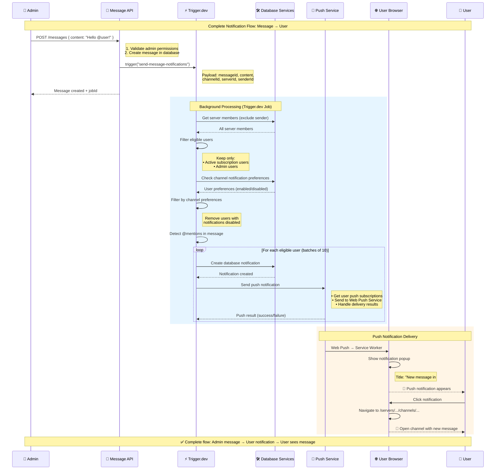

# TRADERSUTOPIA Notification System - Sequence Diagram

## 📋 Overview
This sequence diagram shows the step-by-step interaction between different components when an admin sends a message and users receive notifications.

## 🔄 Complete Message-to-User Sequence



## 🕐 Timing Breakdown

### Phase 1: Immediate Response (< 1 second)
- Admin sends message
- API validates and creates message
- Returns response to admin
- Triggers background job

### Phase 2: Background Processing (1-5 seconds)
- Trigger.dev job starts
- Database queries for members and preferences
- User filtering and notification creation
- Push notification sending (batched)

### Phase 3: User Delivery (< 1 second)
- Browser receives push notification
- Service worker shows notification popup
- User sees notification immediately

## 📊 Detailed Component Interactions

### 1. Message API (`/api/servers/.../messages`)
```typescript
POST → Validate Admin → Create Message → Trigger Job → Return Response
```

### 2. Trigger.dev Job (`sendMessageNotifications`)
```typescript
Start → Get Members → Filter Eligible → Check Preferences → Create Notifications → Send Push
```

### 3. Push Service (`src/lib/push-notifications.ts`)
```typescript
Get Subscriptions → Filter Valid → Send to Web Push → Handle Results → Update Database
```

### 4. Browser Service Worker
```typescript
Receive Push → Parse Payload → Show Notification → Handle Click → Navigate
```

## 🎯 Key Decision Points

### User Eligibility Filter
```
All Server Members → Active Subscription OR Admin → Channel Notifications Enabled
```

### Push Subscription Validation
```
User Subscriptions → isActive=true → failureCount<5 → Send Notification
```

### Error Handling Flow
```
Push Failure → Check Error Type → 410/404: Deactivate → Other: Increment Count
```

## 📱 Notification Payload Structure

```json
{
  "title": "New message in ServerName #channelName",
  "body": "AdminName: message content preview...",
  "icon": "/logo.png",
  "badge": "/logo.png",
  "data": {
    "url": "/servers/serverId/channels/channelId",
    "notificationId": "notification-uuid",
    "type": "NEW_MESSAGE",
    "timestamp": 1691234567890
  },
  "requireInteraction": true,  // if mentioned
  "tag": "NEW_MESSAGE-timestamp",
  "renotify": true
}
```

## 🔄 Parallel Processing

The system processes notifications in **batches of 10 users** for optimal performance:

1. **Batch 1**: Users 1-10 processed simultaneously
2. **100ms delay** between batches
3. **Batch 2**: Users 11-20 processed simultaneously
4. **Continue** until all eligible users notified

## 📈 Performance Metrics

### Expected Timing
- **Message Creation**: ~200ms
- **Job Trigger**: ~100ms
- **Background Processing**: 1-5 seconds (depends on user count)
- **Push Delivery**: ~500ms
- **Total User Experience**: 2-6 seconds from send to notification

### Scalability
- **10 users**: ~1 second processing
- **100 users**: ~3 seconds processing
- **1000 users**: ~15 seconds processing (10 batches)

This sequence diagram provides a detailed view of how each component interacts in the TRADERSUTOPIA notification system, ensuring reliable and timely message delivery to users.