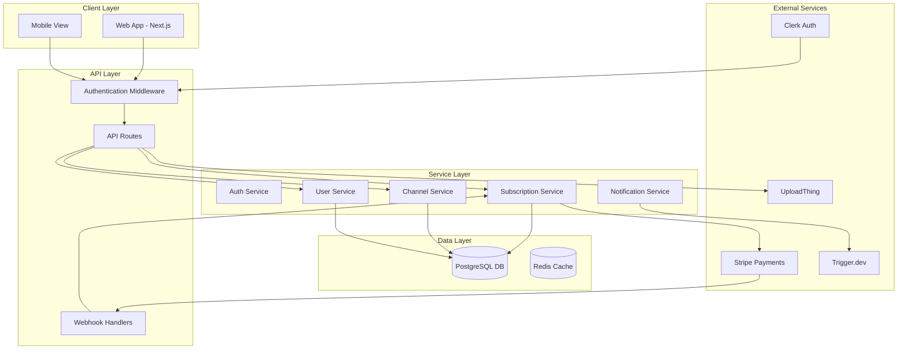
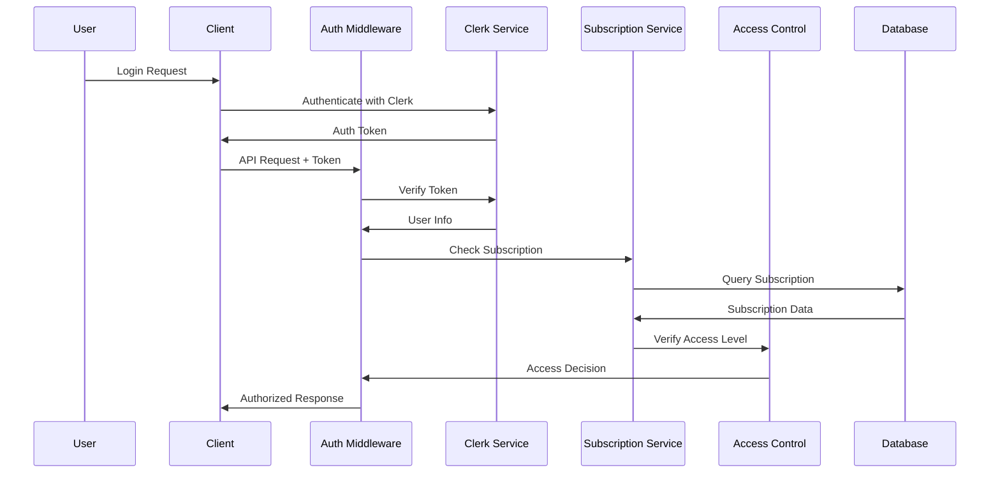
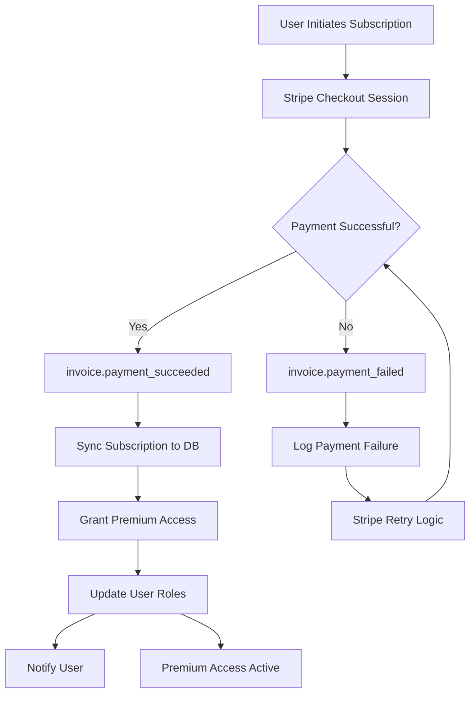
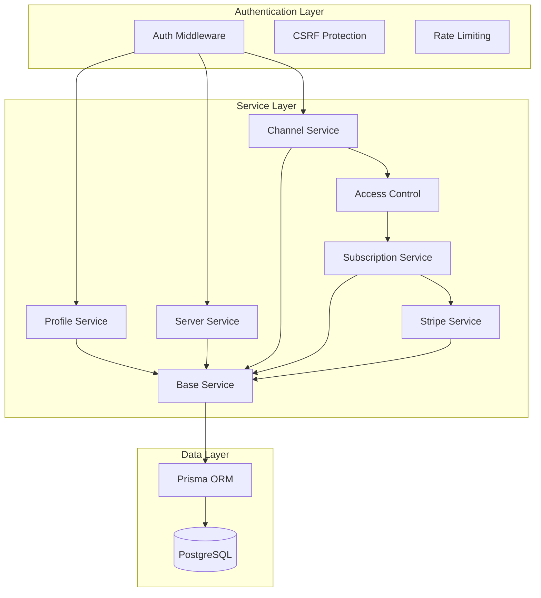
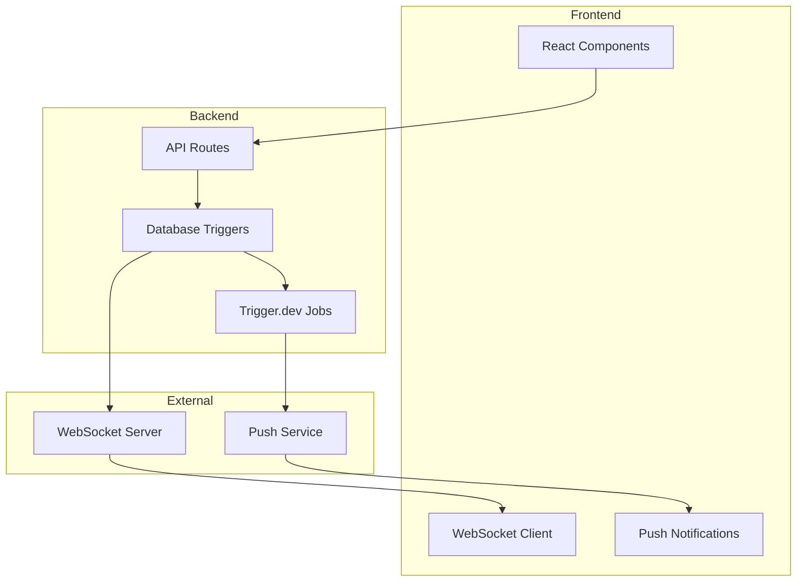
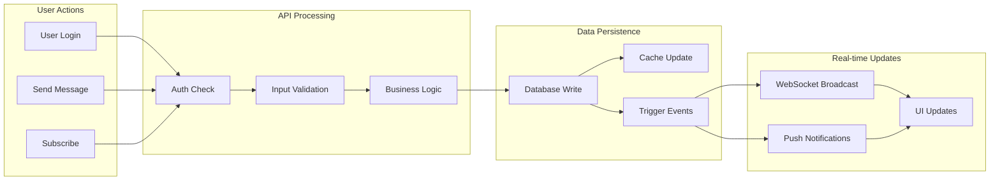

# Ticket 6.1: System Architecture Diagrams
**Priority:** HIGH | **Effort:** 2 days | **Risk:** Low

## Description
Create comprehensive Mermaid diagrams documenting the application's architecture, service layers, and data flow after the refactoring.

## Architecture Diagrams to Create

### 1. High-Level System Architecture


### 2. Authentication & Authorization Flow


### 3. Subscription Management Flow


### 4. Service Layer Dependencies


### 5. Real-Time Communication Architecture


### 6. Data Flow Architecture


## Files to Create
- `docs/architecture/system-overview.md`
- `docs/architecture/authentication-flow.md`
- `docs/architecture/subscription-management.md`
- `docs/architecture/service-dependencies.md`
- `docs/architecture/real-time-communication.md`
- `docs/architecture/data-flow.md`

## Implementation Details

### System Overview Document Structure
```markdown
# System Architecture Overview

## High-Level Architecture
[Mermaid diagram]

## Core Components
- **Client Layer**: Next.js web application with mobile-responsive design
- **API Layer**: RESTful API routes with authentication middleware
- **Service Layer**: Business logic encapsulation with base service patterns
- **Data Layer**: PostgreSQL with Prisma ORM and Redis caching

## External Integrations
- **Authentication**: Clerk for user management
- **Payments**: Stripe for subscription handling
- **File Storage**: UploadThing for file uploads
- **Background Jobs**: Trigger.dev for notifications

## Security Architecture
- CSRF protection on all state-changing operations
- Rate limiting per user and endpoint
- Role-based access control with subscription tiers
- Webhook signature verification
```

### Authentication Flow Documentation
```markdown
# Authentication & Authorization Flow

## Authentication Process
[Sequence diagram]

## Authorization Levels
1. **Free Users**: Basic access to public channels
2. **Premium Users**: Access to premium channels and features
3. **Admin Users**: Full system administration capabilities

## Security Measures
- JWT token validation via Clerk
- Subscription status verification
- Real-time access updates on subscription changes
```

## Acceptance Criteria
- [ ] Create 6+ comprehensive architecture diagrams using Mermaid
- [ ] Document all major system components and their interactions
- [ ] Show authentication and authorization flows clearly
- [ ] Illustrate subscription management lifecycle
- [ ] Provide service layer dependency mapping
- [ ] Include real-time communication patterns
- [ ] Document data flow from user actions to UI updates
- [ ] Ensure diagrams are maintainable and version-controlled

### Documentation Requirements
- [ ] Create comprehensive architecture documentation in `docs/architecture/` directory
- [ ] Document diagram maintenance procedures and update guidelines
- [ ] Add architecture decision records (ADRs) explaining key design choices

### Testing Requirements
- [ ] **Documentation Tests**: Verify all architecture diagrams render correctly
- [ ] **Accuracy Tests**: Validate diagrams match actual implementation
- [ ] **Completeness Tests**: Ensure all major system components are documented
- [ ] **Maintenance Tests**: Verify diagram update procedures work correctly

## Dependencies
- Completion of Phases 1-5 (to accurately reflect final architecture)

## Context
This ticket is part of **Phase 6: Comprehensive Documentation & Architecture Diagrams**, which creates comprehensive architecture diagrams, database schema visualizations, and updated developer guides to ensure the application is maintainable and new developers can onboard effectively. 