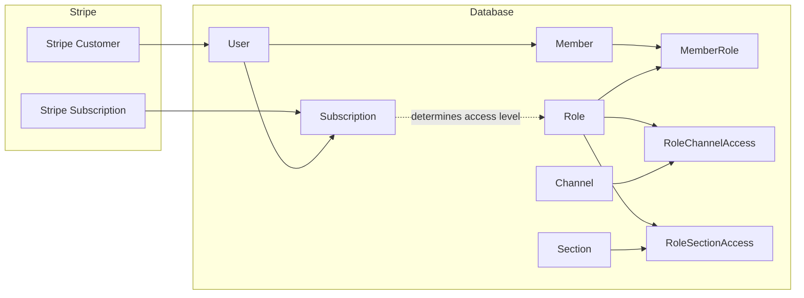
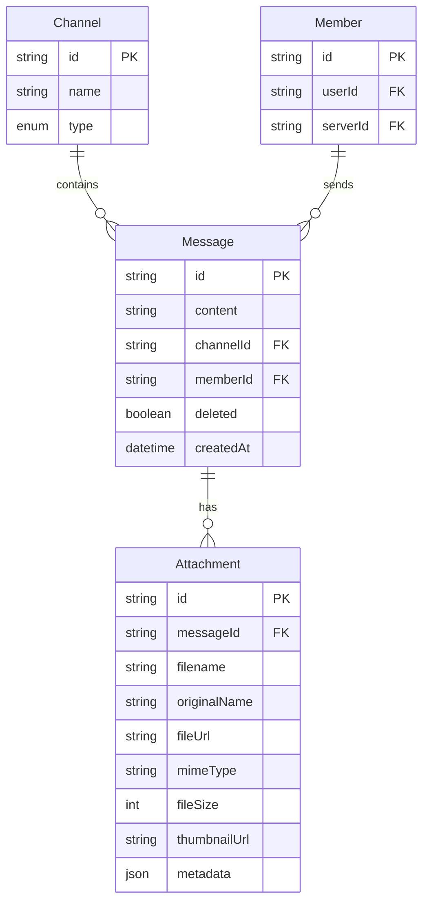
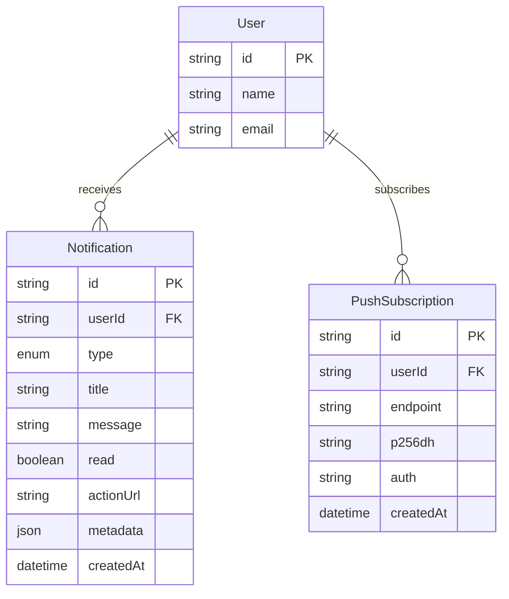
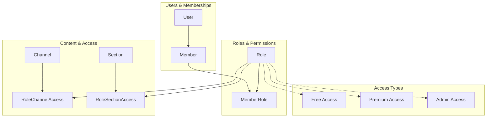

# Ticket 6.2: Database Schema Visualization
**Priority:** HIGH | **Effort:** 1 day | **Risk:** Low

## Description
Create comprehensive Mermaid Entity-Relationship diagrams documenting the database schema, relationships, and data flow.

## Database Diagrams to Create

### 1. Complete Entity-Relationship Diagram
```mermaid
erDiagram
    User {
        string id PK
        string userId UK "Clerk ID"
        string email UK
        string name
        string imageUrl
        boolean isAdmin
        datetime createdAt
        datetime updatedAt
    }
    
    Subscription {
        string id PK
        string userId UK FK
        string stripeSubscriptionId UK
        string stripeCustomerId
        enum status
        string currency
        datetime created
        datetime currentPeriodStart
        datetime currentPeriodEnd
        datetime cancelAt
        boolean cancelAtPeriodEnd
        datetime trialStart
        datetime trialEnd
        string defaultPaymentMethod
        string latestInvoice
        json items
        json metadata
    }
    
    Server {
        string id PK
        string name
        string imageUrl
        string inviteCode UK
        string ownerId FK
        datetime createdAt
        datetime updatedAt
    }
    
    Member {
        string id PK
        string userId FK
        string serverId FK
        datetime joinedAt
        datetime createdAt
        datetime updatedAt
    }
    
    Role {
        string id PK
        string name
        string color
        string serverId FK
        string creatorId FK
        boolean isDefault
        datetime createdAt
        datetime updatedAt
    }
    
    MemberRole {
        string id PK
        string memberId FK
        string roleId FK
        datetime assignedAt
    }
    
    Section {
        string id PK
        string name
        string serverId FK
        string creatorId FK
        int position
        datetime createdAt
        datetime updatedAt
    }
    
    Channel {
        string id PK
        string name
        enum type
        string serverId FK
        string sectionId FK
        string creatorId FK
        int position
        datetime createdAt
        datetime updatedAt
    }
    
    RoleChannelAccess {
        string id PK
        string roleId FK
        string channelId FK
        datetime createdAt
    }
    
    RoleSectionAccess {
        string id PK
        string roleId FK
        string sectionId FK
        datetime createdAt
    }
    
    Message {
        string id PK
        string content
        string fileUrl
        string channelId FK
        string memberId FK
        boolean deleted
        datetime createdAt
        datetime updatedAt
    }
    
    Attachment {
        string id PK
        string messageId FK
        string filename
        string originalName
        string fileUrl
        string mimeType
        int fileSize
        string thumbnailUrl
        json metadata
        datetime createdAt
    }
    
    Notification {
        string id PK
        string userId FK
        enum type
        string title
        string message
        boolean read
        string actionUrl
        json metadata
        datetime createdAt
    }
    
    PushSubscription {
        string id PK
        string userId FK
        string endpoint
        string p256dh
        string auth
        datetime createdAt
        datetime updatedAt
    }
    
    User ||--o| Subscription : "has"
    User ||--o{ Member : "joins servers as"
    User ||--o{ Server : "owns"
    User ||--o{ Role : "creates"
    User ||--o{ Section : "creates"
    User ||--o{ Channel : "creates"
    User ||--o{ Notification : "receives"
    User ||--o{ PushSubscription : "subscribes to"
    
    Server ||--o{ Member : "has"
    Server ||--o{ Role : "contains"
    Server ||--o{ Section : "contains"
    Server ||--o{ Channel : "contains"
    
    Member ||--o{ MemberRole : "has"
    Member ||--o{ Message : "sends"
    
    Role ||--o{ MemberRole : "assigned to"
    Role ||--o{ RoleChannelAccess : "grants access"
    Role ||--o{ RoleSectionAccess : "grants access"
    
    Section ||--o{ Channel : "contains"
    Section ||--o{ RoleSectionAccess : "protected by"
    
    Channel ||--o{ RoleChannelAccess : "protected by"
    Channel ||--o{ Message : "contains"
    
    Message ||--o{ Attachment : "has"
```

### 2. Subscription & Access Control Flow


### 3. Message & Attachment Relationships


### 4. Notification System Schema


### 5. Role-Based Access Control Model


## Files to Create
- `docs/database/schema-overview.md`
- `docs/database/entity-relationships.md`
- `docs/database/access-control-model.md`
- `docs/database/subscription-model.md`
- `docs/database/messaging-schema.md`
- `docs/database/notification-schema.md`

## Documentation Content

### Schema Overview Document
```markdown
# Database Schema Overview

## Core Entities
- **User**: Central user entity linked to Clerk authentication
- **Subscription**: Stripe subscription data for premium access
- **Server**: Discord-like server containers
- **Member**: User membership in servers
- **Role**: Permission roles within servers
- **Channel**: Communication channels within servers
- **Message**: User messages in channels

## Key Relationships
- Users can have multiple server memberships
- Servers contain multiple channels organized in sections
- Roles control access to channels and sections
- Subscriptions determine premium role assignments

## Access Control
- Role-based permissions for channels and sections
- Subscription status determines premium access
- Admin users have full system access
```

### Entity Relationships Document
```markdown
# Entity Relationships

## Primary Relationships
[Complete ER Diagram]

## Relationship Types
1. **One-to-One**: User ↔ Subscription
2. **One-to-Many**: Server → Channels, User → Members
3. **Many-to-Many**: Members ↔ Roles (via MemberRole)

## Foreign Key Constraints
- All references include proper cascade rules
- Soft deletes for message content
- Audit trails for subscription changes
```

## Database Documentation Standards

### Field Documentation
```markdown
## Field Types and Constraints

### Primary Keys
- All entities use UUID primary keys
- Generated using `cuid()` for uniqueness

### Foreign Keys
- Proper referential integrity constraints
- Cascade delete where appropriate
- Indexed for performance

### Enums
- Subscription status: FREE, TRIALING, ACTIVE, PAST_DUE, CANCELED, etc.
- Channel types: TEXT, VOICE, ANNOUNCEMENT
- Notification types: MESSAGE, MENTION, SUBSCRIPTION, SYSTEM
```

## Acceptance Criteria
- [ ] Create complete ER diagram showing all tables and relationships
- [ ] Document subscription and access control data flow
- [ ] Show role-based access control implementation
- [ ] Include field types, constraints, and indexes
- [ ] Provide clear relationship documentation
- [ ] Document messaging and attachment schema
- [ ] Include notification system schema
- [ ] Show data flow for premium access control

### Documentation Requirements
- [ ] Create comprehensive database documentation in `docs/database/` directory
- [ ] Document database optimization guidelines and query patterns
- [ ] Add migration procedures and troubleshooting guides

### Testing Requirements
- [ ] **Schema Tests**: Verify all database diagrams match actual schema
- [ ] **Relationship Tests**: Validate all foreign key relationships are documented
- [ ] **Documentation Tests**: Ensure all table fields and constraints are documented
- [ ] **Completeness Tests**: Verify no database entities are missing from documentation

## Dependencies
- Ticket 1.2 (Database Schema Migration Planning) completion
- Ticket 3.1 (Database Schema Migration) completion

## Context
This ticket is part of **Phase 6: Comprehensive Documentation & Architecture Diagrams**, which creates comprehensive architecture diagrams, database schema visualizations, and updated developer guides to ensure the application is maintainable and new developers can onboard effectively. 