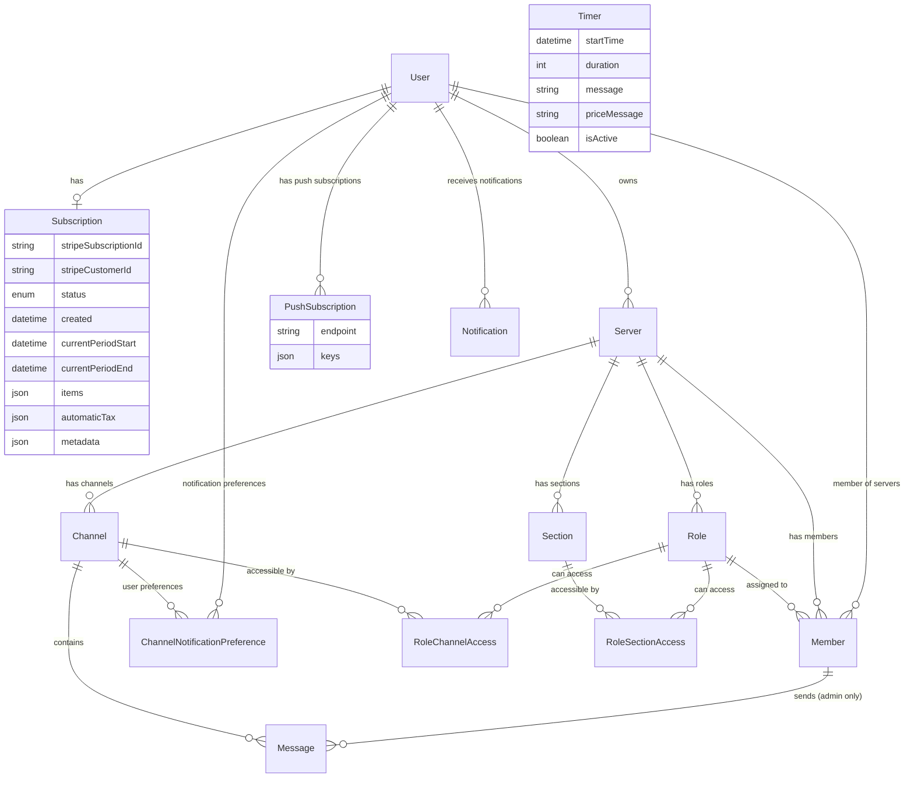

# Database Schema Improvement Plan

## Overview

This document outlines the implementation plan for the improved database schema that addresses the current issues and provides a solid foundation for the Discord-like app with role-based access control and Stripe integration.

## Recent Updates (Latest Version)

### ✅ Schema Refinements
- **User Model**: Changed `clerkId` to `userId` for consistency
- **Subscription Model**: Full alignment with Stripe subscription object structure
- **PushSubscription Model**: Separated from User model with proper endpoint/keys structure
- **Timer Model**: Updated table mapping to `timers`

### ✅ Enhanced Features
- **Database Trigger**: Automatic message notifications via PostgreSQL trigger
- **Stripe Integration**: Complete field mapping for all Stripe subscription attributes
- **Notification System**: Enhanced metadata structure for subscription events
- **Status Mapping**: Full enum alignment with Stripe subscription statuses

### ✅ Implementation Details
- **Migration Logic**: Updated to handle new field names and structures
- **Webhook Handlers**: Complete Stripe subscription object mapping
- **Access Control**: Refined role-based channel/section access
- **Performance**: Database triggers for real-time notifications

## Current Problems Solved

### ❌ Before (Issues)
- Subscription data duplicated between Profile and Member models
- Complex permission system when only admins send messages
- No proper role-based access control for channels/sections
- Inconsistent notification system
- Stripe not treated as source of truth
- Unused DM models taking up space

### ✅ After (Solutions)
- Single source of truth for subscriptions via dedicated Subscription model
- Simplified role system (premium/free) that's extensible
- Clean access control via RoleChannelAccess/RoleSectionAccess
- Enhanced notification system supporting subscription events
- Stripe webhooks properly integrated
- Removed unused DM functionality

## Schema Architecture

### Core Models



### Updated Models Overview

#### Core User Management
- **User**: Clean user model with Clerk integration (`userId` field)
- **Subscription**: Stripe-aligned model with all Stripe subscription fields
- **PushSubscription**: Web push notification endpoints and encryption keys

#### Server & Access Control  
- **Server**: Discord-like server structure with admin ownership
- **Role**: Extensible role system (currently premium/free)
- **RoleChannelAccess** & **RoleSectionAccess**: Granular access control
- **Member**: User membership in servers with single role assignment

#### Content & Communication
- **Channel**: Text/announcement channels with role-based access
- **Section**: Channel categories with hierarchical structure
- **Message**: Admin-only messaging with automatic notifications
- **Notification**: Enhanced system supporting subscription events

#### Supporting Models
- **ChannelNotificationPreference**: Per-channel notification settings
- **Timer**: App-specific countdown functionality

## Implementation Plan

### Phase 1: Schema Migration Strategy

#### 1.1 Pre-Migration Data Backup
```bash
# Backup current data before migration
pg_dump $DATABASE_URL > backup_$(date +%Y%m%d_%H%M%S).sql
```

#### 1.2 Migration Steps
1. **Create new models** (User, Subscription, Role, etc.)
2. **Migrate Profile data to User**
3. **Extract subscription data to Subscription model**
4. **Create default roles** (premium, free)
5. **Migrate Member data with role assignments**
6. **Drop old models** (Profile, Conversation, DirectMessage)

#### 1.3 Data Migration Logic
```typescript
// Example migration logic for Profile -> User + Subscription
const migrateProfileData = async () => {
  const profiles = await prisma.profile.findMany();
  
  for (const profile of profiles) {
    // Create User with updated field name
    const user = await prisma.user.create({
      data: {
        userId: profile.userId, // Changed from clerkId to userId
        email: profile.email,
        name: profile.name,
        imageUrl: profile.imageUrl,
        isAdmin: profile.isAdmin,
      }
    });
    
    // Create Subscription with Stripe-aligned fields
    if (profile.stripeCustomerId) {
      await prisma.subscription.create({
        data: {
          userId: user.id,
          stripeCustomerId: profile.stripeCustomerId,
          stripeSubscriptionId: profile.stripeSubscriptionId,
          status: mapLegacyStatus(profile.subscriptionStatus),
          created: profile.subscriptionCreated || new Date(),
          currentPeriodStart: profile.subscriptionStart,
          currentPeriodEnd: profile.subscriptionEnd,
          currency: profile.subscriptionCurrency || 'usd',
          cancelAtPeriodEnd: false,
          discountPercent: profile.discountPercent,
          discountName: profile.discountName,
          lastInvoiceUrl: profile.lastInvoiceUrl,
          // Map other Stripe fields as available
        }
      });
    }
    
    // Migrate push notification preferences to new format
    if (profile.pushSubscriptions?.length > 0) {
      for (const pushSub of profile.pushSubscriptions) {
        await prisma.pushSubscription.create({
          data: {
            userId: user.id,
            endpoint: pushSub.endpoint,
            keys: pushSub.keys,
          }
        });
      }
    }
  }
};

// Helper function to map legacy status to new Stripe-aligned status
const mapLegacyStatus = (oldStatus: string) => {
  const statusMap = {
    'FREE': 'FREE',
    'ACTIVE': 'ACTIVE', 
    'EXPIRED': 'CANCELED',
    'CANCELLED': 'CANCELED'
  };
  return statusMap[oldStatus] || 'FREE';
};
```

### Phase 2: Role-Based Access Control Implementation

#### 2.1 Default Role Creation
```typescript
// Create default roles for each server
const createDefaultRoles = async (serverId: string) => {
  const freeRole = await prisma.role.create({
    data: {
      name: 'free',
      serverId,
      creatorId: serverOwnerId,
      isDefault: true,
    }
  });
  
  const premiumRole = await prisma.role.create({
    data: {
      name: 'premium',
      serverId,
      creatorId: serverOwnerId,
      color: '#FFD700', // Gold color for premium
    }
  });
  
  return { freeRole, premiumRole };
};
```

#### 2.2 Access Control Logic
```typescript
// Check if user can access channel
const canUserAccessChannel = async (userId: string, channelId: string) => {
  const member = await prisma.member.findFirst({
    where: { userId, server: { channels: { some: { id: channelId } } } },
    include: { role: { include: { channelAccess: true } } }
  });
  
  if (!member) return false;
  
  // Check if role has access to this channel
  const hasAccess = member.role.channelAccess.some(
    access => access.channelId === channelId
  );
  
  return hasAccess;
};
```

### Phase 3: Stripe Integration

#### 3.1 Webhook Handler Updates
```typescript
// Enhanced Stripe webhook handling with full field mapping
export const handleSubscriptionUpdate = async (subscription: Stripe.Subscription) => {
  // Find user by Stripe customer ID
  const existingSubscription = await prisma.subscription.findFirst({
    where: { stripeCustomerId: subscription.customer as string },
    include: { user: true }
  });
  
  const subscriptionData = {
    stripeCustomerId: subscription.customer as string,
    stripeSubscriptionId: subscription.id,
    status: mapStripeStatus(subscription.status),
    currency: subscription.currency,
    created: new Date(subscription.created * 1000),
    currentPeriodStart: new Date(subscription.current_period_start * 1000),
    currentPeriodEnd: new Date(subscription.current_period_end * 1000),
    startDate: new Date(subscription.start_date * 1000),
    
    // Cancellation fields
    cancelAt: subscription.cancel_at ? new Date(subscription.cancel_at * 1000) : null,
    cancelAtPeriodEnd: subscription.cancel_at_period_end,
    canceledAt: subscription.canceled_at ? new Date(subscription.canceled_at * 1000) : null,
    endedAt: subscription.ended_at ? new Date(subscription.ended_at * 1000) : null,
    
    // Trial fields
    trialStart: subscription.trial_start ? new Date(subscription.trial_start * 1000) : null,
    trialEnd: subscription.trial_end ? new Date(subscription.trial_end * 1000) : null,
    
    // Payment and billing
    defaultPaymentMethod: subscription.default_payment_method as string,
    latestInvoice: subscription.latest_invoice as string,
    collectionMethod: subscription.collection_method,
    
    // Subscription items and complex fields
    items: subscription.items,
    automaticTax: subscription.automatic_tax,
    billingCycleAnchor: subscription.billing_cycle_anchor ? 
      new Date(subscription.billing_cycle_anchor * 1000) : null,
    description: subscription.description,
    metadata: subscription.metadata,
    pendingSetupIntent: subscription.pending_setup_intent as string,
    pendingUpdate: subscription.pending_update,
  };

  await prisma.subscription.upsert({
    where: { stripeSubscriptionId: subscription.id },
    create: {
      ...subscriptionData,
      userId: existingSubscription?.userId || await findUserIdByCustomer(subscription.customer as string)
    },
    update: subscriptionData
  });
  
  // Update member roles based on subscription status
  await updateMemberRoleBasedOnSubscription(subscription);
};

// Map Stripe status to our enum values
const mapStripeStatus = (stripeStatus: string): SubscriptionStatus => {
  const statusMap = {
    'incomplete': 'INCOMPLETE',
    'incomplete_expired': 'INCOMPLETE_EXPIRED', 
    'trialing': 'TRIALING',
    'active': 'ACTIVE',
    'past_due': 'PAST_DUE',
    'canceled': 'CANCELED',
    'unpaid': 'UNPAID',
    'paused': 'PAUSED'
  };
  return statusMap[stripeStatus] || 'FREE';
};
```

#### 3.2 Automatic Role Assignment
```typescript
// Auto-assign premium role when subscription becomes active
const updateMemberRoleBasedOnSubscription = async (subscription: Stripe.Subscription) => {
  const dbSubscription = await prisma.subscription.findUnique({
    where: { stripeSubscriptionId: subscription.id },
    include: { user: { include: { members: { include: { server: { include: { roles: true } } } } } } }
  });
  
  if (!dbSubscription) return;
  
  const isPremium = ['active', 'trialing'].includes(subscription.status);
  
  for (const member of dbSubscription.user.members) {
    const targetRole = member.server.roles.find(role => 
      role.name === (isPremium ? 'premium' : 'free')
    );
    
    if (targetRole && member.roleId !== targetRole.id) {
      await prisma.member.update({
        where: { id: member.id },
        data: { roleId: targetRole.id }
      });
    }
  }
};
```

### Phase 4: Enhanced Notification System

#### 4.1 Subscription Event Notifications
```typescript
// Create notification for subscription events
const createSubscriptionNotification = async (
  userId: string, 
  type: NotificationType, 
  metadata: any
) => {
  await prisma.notification.create({
    data: {
      userId,
      type,
      title: getNotificationTitle(type),
      message: getNotificationMessage(type, metadata),
      metadata,
    }
  });
};

// Handle different subscription events
const handleSubscriptionCancelled = async (subscription: Stripe.Subscription) => {
  const dbSub = await prisma.subscription.findUnique({
    where: { stripeSubscriptionId: subscription.id }
  });
  
  if (dbSub) {
    await createSubscriptionNotification(
      dbSub.userId,
      'SUBSCRIPTION_CANCELLED',
      {
        cancelDate: new Date(subscription.canceled_at! * 1000),
        periodEnd: new Date(subscription.current_period_end * 1000)
      }
    );
  }
};
```

#### 4.2 Automatic Message Notifications (Database Trigger)
```sql
-- PostgreSQL trigger for automatic message notifications
CREATE OR REPLACE FUNCTION notify_channel_subscribers_optimized()
RETURNS TRIGGER AS $$
DECLARE
    sender_user_id TEXT;
    channel_name TEXT;
    sender_name TEXT;
    server_id TEXT;
BEGIN
    -- Get sender info and channel details
    SELECT 
        u.id,
        u.name,
        c.name,
        c."serverId"
    INTO sender_user_id, sender_name, channel_name, server_id
    FROM users u
    INNER JOIN members m ON u.id = m."userId"
    INNER JOIN channels c ON NEW."channelId" = c.id
    WHERE m.id = NEW."memberId";

    -- Batch insert notifications for eligible subscribers
    INSERT INTO notifications (
        id,
        "userId",
        type,
        title,
        message,
        "actionUrl",
        metadata,
        "createdAt"
    )
    SELECT 
        gen_random_uuid()::text,
        cnp."userId",
        'NEW_MESSAGE',
        'New message in #' || channel_name,
        sender_name || ': ' || LEFT(NEW.content, 100) || 
            CASE WHEN LENGTH(NEW.content) > 100 THEN '...' ELSE '' END,
        '/servers/' || server_id || '/channels/' || NEW."channelId",
        jsonb_build_object(
            'channelId', NEW."channelId",
            'messageId', NEW.id,
            'senderId', sender_user_id,
            'senderName', sender_name,
            'channelName', channel_name
        ),
        NOW()
    FROM channel_notification_preferences cnp
    INNER JOIN users u ON cnp."userId" = u.id
    INNER JOIN members m ON u.id = m."userId" 
    INNER JOIN roles r ON m."roleId" = r.id
    INNER JOIN role_channel_access rca ON r.id = rca."roleId"
    WHERE cnp."channelId" = NEW."channelId"
    AND cnp.enabled = true
    AND cnp."userId" != sender_user_id
    AND rca."channelId" = NEW."channelId"
    AND m."serverId" = server_id;

    RETURN NEW;
END;
$$ LANGUAGE plpgsql;

-- Create the trigger
CREATE TRIGGER message_notification_trigger
    AFTER INSERT ON messages
    FOR EACH ROW
    EXECUTE FUNCTION notify_channel_subscribers_optimized();
```

#### 4.3 Application-Level Notification Handling
```typescript
// Alternative/supplementary notification logic
const notifyChannelSubscribers = async (message: Message) => {
  const subscribers = await prisma.channelNotificationPreference.findMany({
    where: { 
      channelId: message.channelId,
      enabled: true 
    },
    include: { user: true }
  });
  
  for (const subscriber of subscribers) {
    // Check if user has access to channel
    const hasAccess = await canUserAccessChannel(subscriber.userId, message.channelId);
    
    if (hasAccess) {
      await createNotification(subscriber.userId, 'NEW_MESSAGE', {
        channelId: message.channelId,
        messageId: message.id,
        sender: message.member.user.name
      });
    }
  }
};
```

### Phase 5: API Implementation

#### 5.1 Access Control Middleware
```typescript
// Middleware to check channel access
export const checkChannelAccess = async (req: Request, res: Response, next: NextFunction) => {
  const { channelId } = req.params;
  const { userId } = auth();
  
  const hasAccess = await canUserAccessChannel(userId, channelId);
  
  if (!hasAccess) {
    return res.status(403).json({ error: 'Access denied' });
  }
  
  next();
};

// Protected route example
app.get('/api/channels/:channelId/messages', checkChannelAccess, async (req, res) => {
  // User has access, fetch messages
  const messages = await getChannelMessages(req.params.channelId);
  res.json(messages);
});
```

#### 5.2 Admin-Only Message Sending
```typescript
// Only admins can send messages
export async function POST(req: Request) {
  const { userId } = auth();
  const user = await prisma.user.findUnique({ where: { userId } }); // Updated field name
  
  if (!user?.isAdmin) {
    return new NextResponse('Only admins can send messages', { status: 403 });
  }
  
  // Validate input
  const { content, channelId } = await req.json();
  const validation = messageSchema.parse({ content, channelId });
  
  // Find member record for this user in the channel's server
  const member = await prisma.member.findFirst({
    where: {
      userId: user.id,
      server: {
        channels: {
          some: { id: channelId }
        }
      }
    }
  });
  
  if (!member) {
    return new NextResponse('Member not found in server', { status: 404 });
  }
  
  // Create message (trigger will handle notifications automatically)
  const message = await prisma.message.create({
    data: {
      content: validation.content,
      channelId: validation.channelId,
      memberId: member.id,
    },
    include: {
      member: {
        include: { user: true }
      },
      channel: true
    }
  });
  
  return NextResponse.json(message);
}
```

### Phase 6: Performance Optimizations

#### 6.1 Database Indexes
```prisma
// Key indexes for performance
@@index([userId])           // Fast user lookups
@@index([serverId])         // Fast server queries
@@index([roleId])           // Fast role-based queries
@@index([channelId])        // Fast channel queries
@@index([createdAt])        // Fast time-based queries
@@index([type])             // Fast notification filtering
```

#### 6.2 Caching Strategy
```typescript
// Cache role access for performance
const roleAccessCache = new Map<string, Set<string>>();

const getCachedChannelAccess = async (roleId: string): Promise<Set<string>> => {
  if (roleAccessCache.has(roleId)) {
    return roleAccessCache.get(roleId)!;
  }
  
  const access = await prisma.roleChannelAccess.findMany({
    where: { roleId },
    select: { channelId: true }
  });
  
  const channelIds = new Set(access.map(a => a.channelId));
  roleAccessCache.set(roleId, channelIds);
  
  return channelIds;
};
```

## Migration Timeline

### Week 1: Schema Setup
- [ ] Create new Prisma schema
- [ ] Write migration scripts
- [ ] Test migration on development database

### Week 2: Data Migration
- [ ] Backup production data
- [ ] Run migrations in staging
- [ ] Validate data integrity
- [ ] Performance testing

### Week 3: Database Triggers & API Updates
- [ ] Create and test message notification trigger
- [ ] Update API endpoints to use new schema (User.userId field)
- [ ] Implement enhanced access control middleware
- [ ] Update Stripe webhook handlers with full field mapping
- [ ] Test automatic role assignment logic

### Week 4: Frontend & Notification Updates
- [ ] Update React components to use new API structure
- [ ] Test role-based UI changes with new access control
- [ ] Update notification handling for new metadata format
- [ ] Implement push notification integration with new schema
- [ ] Test channel notification preferences

### Week 5: Integration Testing & Performance
- [ ] End-to-end testing with database triggers
- [ ] Load testing for notification system
- [ ] Stripe webhook integration testing
- [ ] Performance optimization for role-based queries
- [ ] Test subscription status change workflows

### Week 6: Deployment & Monitoring
- [ ] Production deployment with rollback plan
- [ ] Monitor database trigger performance
- [ ] Monitor Stripe webhook processing
- [ ] Validate notification delivery rates
- [ ] User acceptance testing

## Key Benefits

### For Development
- **Cleaner Architecture**: Separated concerns with dedicated models
- **Better Performance**: Optimized queries with proper indexes + database triggers
- **Extensibility**: Easy to add new roles and permissions
- **Maintainability**: Simpler codebase without unused features
- **Automatic Notifications**: Database triggers ensure consistent notification delivery
- **Stripe Alignment**: Direct mapping to Stripe subscription object structure

### For Business
- **Stripe Integration**: Automatic role assignment based on subscriptions
- **Real-time Notifications**: Instant message notifications via database triggers
- **User Experience**: Better notifications and granular access control
- **Scalability**: Schema designed to handle growth with efficient indexing
- **Flexibility**: Can easily add new subscription tiers and roles
- **Data Integrity**: Webhook-driven subscription sync with comprehensive field mapping

## Risk Mitigation

### Data Loss Prevention
- Comprehensive backups before migration
- Staging environment testing
- Rollback procedures documented

### Performance Monitoring
- Database query performance tracking
- API response time monitoring
- User experience metrics

### Security Considerations
- Access control validation
- Input sanitization
- Rate limiting implementation

## Success Metrics

### Migration Success
- [ ] Migration completed without data loss
- [ ] All existing user accounts successfully migrated to User model
- [ ] All subscription data properly mapped to new Stripe-aligned fields
- [ ] Push notification subscriptions migrated to separate model

### Performance Benchmarks  
- [ ] API response times < 200ms for typical queries
- [ ] Message notification trigger executes in < 50ms
- [ ] Role-based access queries optimized with proper indexing
- [ ] Webhook processing time < 100ms per subscription update

### Security & Access Control
- [ ] Zero unauthorized access incidents
- [ ] Role-based channel access properly enforced
- [ ] Admin-only message sending validated
- [ ] Notification access control working correctly

### Stripe Integration
- [ ] Subscription sync accuracy 99.9%
- [ ] Automatic role assignment based on subscription status
- [ ] Webhook field mapping covers all Stripe subscription attributes
- [ ] Subscription notifications for cancellations, renewals, discounts

### User Experience
- [ ] Real-time notifications working for subscribed channels
- [ ] User notification preferences properly respected
- [ ] Message notifications include proper metadata and links
- [ ] Push notification system functional with new schema

### System Reliability
- [ ] Database triggers perform consistently under load
- [ ] No notification delivery failures due to access control issues
- [ ] Subscription status changes reflect immediately in user roles
- [ ] Error handling robust for edge cases

---

**Next Steps**: Review this plan and approve before proceeding to implementation phase. 